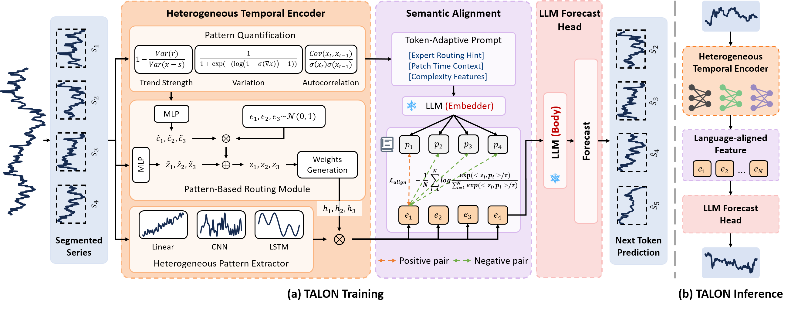

# TALON
The code for TALON
# Adapting LLMs to Time Series Forecasting via Temporal Heterogeneity Modeling and Semantic Alignment

## :sparkles: Abstract


Large Language Models (LLMs) have recently demonstrated impressive capabilities in natural language processing due to their strong generalization and sequence modeling capabilities.
However, their direct application to time series forecasting remains challenging due to two fundamental issues: the inherent heterogeneity of temporal patterns and the modality gap between continuous numerical signals and discrete language representations.
In this work, we propose **TALON**, a unified framework that enhances LLM-based forecasting by modeling temporal heterogeneity and enforcing semantic alignment.
Specifically, we design a Heterogeneous Temporal Encoder that partitions multivariate time series into structurally coherent segments, enabling localized expert modeling across diverse temporal patterns.
To bridge the modality gap, we introduce a Semantic Alignment Module that aligns temporal features with LLM-compatible representations, enabling effective integration of time series into language-based models while eliminating the need for handcrafted prompts during inference.
Extensive experiments on seven real-world benchmarks demonstrate that TALON achieves superior performance across all datasets, with average MSE improvements of up to 11\% over recent state-of-the-art methods.
These results underscore the effectiveness of incorporating both pattern-aware and semantic-aware designs when adapting LLMs for time series forecasting.

## :sparkles: Datasets
You can obtain all the benchmarks from Google Drive (https://drive.google.com/drive/folders/1LrnL3nNNOcrQX2vk2abKahdkw4NGBxbG). All the datasets are well pre-processed and can be used easily.

## :sparkles: How to Run the Code:

1. Install Python 3.6, PyTorch 1.9.0.
2. Install requirements. pip install -r requirements.txt
3. Train the model. We provide the experiment scripts of all benchmarks under the folder ./scripts. Now you can reproduce the experiment results by:

```javascript
sh ./scripts/ETTh1.sh
```

## :sparkling_heart: Acknowledgements

The codes in this repository are inspired by the following:

- https://github.com/thuml/Time-Series-Library
- https://github.com/thuml/OpenLTM
