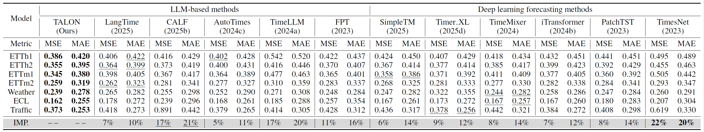

# Adapting LLMs to Time Series Forecasting via Temporal Heterogeneity Modeling and Semantic Alignment

## :sparkles: Abstract


Large Language Models (LLMs) have recently demonstrated impressive capabilities in natural language processing due to their strong generalization and sequence modeling capabilities.
However, their direct application to time series forecasting remains challenging due to two fundamental issues: the inherent heterogeneity of temporal patterns and the modality gap between continuous numerical signals and discrete language representations.
In this work, we propose **TALON**, a unified framework that enhances LLM-based forecasting by modeling temporal heterogeneity and enforcing semantic alignment.
Specifically, we design a Heterogeneous Temporal Encoder that partitions multivariate time series into structurally coherent segments, enabling localized expert modeling across diverse temporal patterns.
To bridge the modality gap, we introduce a Semantic Alignment Module that aligns temporal features with LLM-compatible representations, enabling effective integration of time series into language-based models while eliminating the need for handcrafted prompts during inference.
Extensive experiments on seven real-world benchmarks demonstrate that TALON achieves superior performance across all datasets, with average MSE improvements of up to 11\% over recent state-of-the-art methods.
These results underscore the effectiveness of incorporating both pattern-aware and semantic-aware designs when adapting LLMs for time series forecasting.

## :sparkles: Datasets
You can obtain all the benchmarks from [Time-Series-Library](https://github.com/thuml/Time-Series-Library). All the datasets are well pre-processed and can be used easily.

## :sparkles: How to Run the Code:

1. Install Python 3.10, PyTorch 2.5.1.
2. Install necessary dependencies.
```bash
pip install -r requirements.txt
```
3. Put the datasets under the folder ./dataset/.
4. Download the large language models from [Hugging Face](https://huggingface.co/). The default LLM is GPT-2, you can change the llm_ckp_dir in run.py to use other LLMs.
   - [GPT-2](https://huggingface.co/openai-community/gpt2)
   - [Qwen-0.5B](https://huggingface.co/Qwen/Qwen2.5-0.5B-Instruct)
   - [DeepSeek-1.5B](https://huggingface.co/deepseek-ai/DeepSeek-R1-Distill-Qwen-1.5B)
   - [LLaMA-7B](https://huggingface.co/meta-llama/Llama-2-7b)
   
   For example, if you download and put the LLM directory successfully, the directory structure is as follows:
   - data_provider /
   - dataset /
   - LLM /
     - gpt2 /
         - config.json
         - generation_config.json
         - ...
     - Qwen2-0.5B-Instruct /
     - Deepseek-1.5B /
     - Llama-2-7b /
    - ...
    - run.py
6. Generate the Prompt through the LLM.
```bash
# preprocess prompt to generate text embedding
python ./preprocess.py --gpu 0 --llm_model GPT2 --dataset ETTh1
```
7. Train and evaluate the model. We provide all the above tasks under the folder ./scripts. Now you can reproduce the experiment results by:

```bash
# the default large language model is GPT-2

# long-term forecasting
bash ./scripts/time_series_forecasting/ETTh1.sh

# zero-shot forecasting
bash ./scripts/zero_shot_forecasting/ETTh1_ETTh2.sh

# try on other large language models
bash ./scripts/method_generality/qwen.sh
```

## :trophy: Time Series Forecasting:
One-for-all benchmark: a single forecaster is trained on one dataset and subsequently used for all prediction lengths.




## :sparkling_heart: Acknowledgements

We appreciate the following GitHub repos a lot for their valuable code and efforts.

- [Time-Series-Library](https://github.com/thuml/Time-Series-Library)
- [OpenLTM](https://github.com/thuml/OpenLTM)
- [AutoTimes](https://github.com/thuml/AutoTimes)
